# webgl-parametric-surface-examples
Parametric Surfaces Examples by WebGL

|Title                     |Image                                    |WebGL                                                                                                      |[lightgl.js](https://github.com/evanw/lightgl.js/)                                                         |[processing.js](https://github.com/processing-js/processing-js)                                                 |[three.js](https://github.com/mrdoob/three.js)                                                             |[Babylon.js](https://github.com/BabylonJS/Babylon.js)                                                        |
|:-------------------------|:---------------------------------------:|:---------------------------------------------------------------------------------------------------------:|:---------------------------------------------------------------------------------------------------------:|:--------------------------------------------------------------------------------------------------------------:|:---------------------------------------------------------------------------------------------------------:|:-----------------------------------------------------------------------------------------------------------:|
|Triangle                  |      |[Link](https://cx20.github.io/webgl-parametric-surface-examples/examples/webgl/triangle/index.html)        |[Link](https://cx20.github.io/webgl-parametric-surface-examples/examples/lightgl/triangle/index.html)      |[Link](https://cx20.github.io/webgl-parametric-surface-examples/examples/processingjs/triangle/index.html)      |[Link](https://cx20.github.io/webgl-parametric-surface-examples/examples/threejs/triangle/index.html)      |[Link](https://cx20.github.io/webgl-parametric-surface-examples/examples/babylonjs/triangle/index.html)      |
|Lissajous Curve           |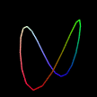     |[Link](https://cx20.github.io/webgl-parametric-surface-examples/examples/webgl/lissajous/index.html)       |[Link](https://cx20.github.io/webgl-parametric-surface-examples/examples/lightgl/lissajous/index.html)     |[Link](https://cx20.github.io/webgl-parametric-surface-examples/examples/processingjs/lissajous/index.html)     |[Link](https://cx20.github.io/webgl-parametric-surface-examples/examples/threejs/lissajous/index.html)     |[Link](https://cx20.github.io/webgl-parametric-surface-examples/examples/babylonjs/lissajous/index.html)     |
|3D Lissajous Curve        |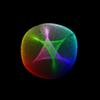   |[Link](https://cx20.github.io/webgl-parametric-surface-examples/examples/webgl/lissajous3d/index.html)     |[Link](https://cx20.github.io/webgl-parametric-surface-examples/examples/lightgl/lissajous3d/index.html)   |[Link](https://cx20.github.io/webgl-parametric-surface-examples/examples/processingjs/lissajous3d/index.html)   |[Link](https://cx20.github.io/webgl-parametric-surface-examples/examples/threejs/lissajous3d/index.html)   |[Link](https://cx20.github.io/webgl-parametric-surface-examples/examples/babylonjs/lissajous3d/index.html)   |
|Harmonograph              |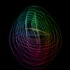  |[Link](https://cx20.github.io/webgl-parametric-surface-examples/examples/webgl/harmonograph/index.html)    |[Link](https://cx20.github.io/webgl-parametric-surface-examples/examples/lightgl/harmonograph/index.html)  |[Link](https://cx20.github.io/webgl-parametric-surface-examples/examples/processingjs/harmonograph/index.html)  |[Link](https://cx20.github.io/webgl-parametric-surface-examples/examples/threejs/harmonograph/index.html)  |[Link](https://cx20.github.io/webgl-parametric-surface-examples/examples/babylonjs/harmonograph/index.html)  |
|Three-dimensional Surface |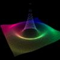            |[Link](https://cx20.github.io/webgl-parametric-surface-examples/examples/webgl/3d/index.html)              |[Link](https://cx20.github.io/webgl-parametric-surface-examples/examples/lightgl/3d/index.html)            |[Link](https://cx20.github.io/webgl-parametric-surface-examples/examples/processingjs/3d/index.html)            |[Link](https://cx20.github.io/webgl-parametric-surface-examples/examples/threejs/3d/index.html)            |[Link](https://cx20.github.io/webgl-parametric-surface-examples/examples/babylonjs/3d/index.html)            |
|Wave Equation             |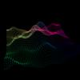 |[Link](https://cx20.github.io/webgl-parametric-surface-examples/examples/webgl/wave-equation/index.html)   |[Link](https://cx20.github.io/webgl-parametric-surface-examples/examples/lightgl/wave-equation/index.html) |[Link](https://cx20.github.io/webgl-parametric-surface-examples/examples/processingjs/wave-equation/index.html) |[Link](https://cx20.github.io/webgl-parametric-surface-examples/examples/threejs/wave-equation/index.html) |[Link](https://cx20.github.io/webgl-parametric-surface-examples/examples/babylonjs/wave-equation/index.html) |
|Roman Surface             |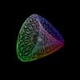         |[Link](https://cx20.github.io/webgl-parametric-surface-examples/examples/webgl/roman/index.html)           |[Link](https://cx20.github.io/webgl-parametric-surface-examples/examples/lightgl/roman/index.html)         |[Link](https://cx20.github.io/webgl-parametric-surface-examples/examples/processingjs/roman/index.html)         |[Link](https://cx20.github.io/webgl-parametric-surface-examples/examples/threejs/roman/index.html)         |[Link](https://cx20.github.io/webgl-parametric-surface-examples/examples/babylonjs/roman/index.html)         |
|Seashell Surface          |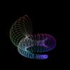      |[Link](https://cx20.github.io/webgl-parametric-surface-examples/examples/webgl/seashell/index.html)        |[Link](https://cx20.github.io/webgl-parametric-surface-examples/examples/lightgl/seashell/index.html)      |[Link](https://cx20.github.io/webgl-parametric-surface-examples/examples/processingjs/seashell/index.html)      |[Link](https://cx20.github.io/webgl-parametric-surface-examples/examples/threejs/seashell/index.html)      |[Link](https://cx20.github.io/webgl-parametric-surface-examples/examples/babylonjs/seashell/index.html)      |
|Apple Surface             |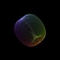         |[Link](https://cx20.github.io/webgl-parametric-surface-examples/examples/webgl/apple/index.html)           |[Link](https://cx20.github.io/webgl-parametric-surface-examples/examples/lightgl/apple/index.html)         |[Link](https://cx20.github.io/webgl-parametric-surface-examples/examples/processingjs/apple/index.html)         |[Link](https://cx20.github.io/webgl-parametric-surface-examples/examples/threejs/apple/index.html)         |[Link](https://cx20.github.io/webgl-parametric-surface-examples/examples/babylonjs/apple/index.html)         |
|Slime Surface             |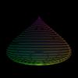         |[Link](https://cx20.github.io/webgl-parametric-surface-examples/examples/webgl/slime/index.html)           |[Link](https://cx20.github.io/webgl-parametric-surface-examples/examples/lightgl/slime/index.html)         |[Link](https://cx20.github.io/webgl-parametric-surface-examples/examples/processingjs/slime/index.html)         |[Link](https://cx20.github.io/webgl-parametric-surface-examples/examples/threejs/slime/index.html)         |[Link](https://cx20.github.io/webgl-parametric-surface-examples/examples/babylonjs/slime/index.html)         |
|Heart Surface             |         |[Link](https://cx20.github.io/webgl-parametric-surface-examples/examples/webgl/heart/index.html)           |[Link](https://cx20.github.io/webgl-parametric-surface-examples/examples/lightgl/heart/index.html)         |[Link](https://cx20.github.io/webgl-parametric-surface-examples/examples/processingjs/heart/index.html)         |[Link](https://cx20.github.io/webgl-parametric-surface-examples/examples/threejs/heart/index.html)         |[Link](https://cx20.github.io/webgl-parametric-surface-examples/examples/babylonjs/heart/index.html)         |
|Torus                     |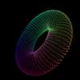         |[Link](https://cx20.github.io/webgl-parametric-surface-examples/examples/webgl/torus/index.html)           |[Link](https://cx20.github.io/webgl-parametric-surface-examples/examples/lightgl/torus/index.html)         |[Link](https://cx20.github.io/webgl-parametric-surface-examples/examples/processingjs/torus/index.html)         |[Link](https://cx20.github.io/webgl-parametric-surface-examples/examples/threejs/torus/index.html)         |[Link](https://cx20.github.io/webgl-parametric-surface-examples/examples/babylonjs/torus/index.html)         |
|Wave ball                 |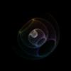     |[Link](https://cx20.github.io/webgl-parametric-surface-examples/examples/webgl/wave-ball/index.html)       |[Link](https://cx20.github.io/webgl-parametric-surface-examples/examples/lightgl/wave-ball/index.html)     |[Link](https://cx20.github.io/webgl-parametric-surface-examples/examples/processingjs/wave-ball/index.html)     |[Link](https://cx20.github.io/webgl-parametric-surface-examples/examples/threejs/wave-ball/index.html)     |[Link](https://cx20.github.io/webgl-parametric-surface-examples/examples/babylonjs/wave-ball/index.html)     |

