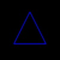

# webgl-parametric-surface-examples
Parametric Surfaces Examples by WebGL

|Title                     |Image                                    |[lightgl.js](https://github.com/evanw/lightgl.js/)                                                         |
|:-------------------------|:---------------------------------------:|:---------------------------------------------------------------------------------------------------------:|
|Triangle                  |      |[Link](https://cx20.github.io/webgl-parametric-surface-examples/examples/lightgl/triangle/index.html)      |
|Lissajous Curve           |     |[Link](https://cx20.github.io/webgl-parametric-surface-examples/examples/lightgl/lissajous/index.html)     |
|3D Lissajous Curve        |   |[Link](https://cx20.github.io/webgl-parametric-surface-examples/examples/lightgl/lissajous3d/index.html)   |
|Harmonograph              |  |[Link](https://cx20.github.io/webgl-parametric-surface-examples/examples/lightgl/harmonograph/index.html)  |
|Three-dimensional Surface |            |[Link](https://cx20.github.io/webgl-parametric-surface-examples/examples/lightgl/3d/index.html)            |
|Wave Equation             | |[Link](https://cx20.github.io/webgl-parametric-surface-examples/examples/lightgl/wave-equation/index.html) |
|Romen Surface             |         |[Link](https://cx20.github.io/webgl-parametric-surface-examples/examples/lightgl/romen/index.html)         |
|Seashell Surface          |      |[Link](https://cx20.github.io/webgl-parametric-surface-examples/examples/lightgl/seashell/index.html)      |
|Apple Surface             |         |[Link](https://cx20.github.io/webgl-parametric-surface-examples/examples/lightgl/apple/index.html)         |
|Slime Surface             |         |[Link](https://cx20.github.io/webgl-parametric-surface-examples/examples/lightgl/slime/index.html)         |
|Heart Surface             |         |[Link](https://cx20.github.io/webgl-parametric-surface-examples/examples/lightgl/heart/index.html)         |
|Torus                     |         |[Link](https://cx20.github.io/webgl-parametric-surface-examples/examples/lightgl/torus/index.html)         |
|Wave ball                 |     |[Link](https://cx20.github.io/webgl-parametric-surface-examples/examples/lightgl/wave-ball/index.html)     |

